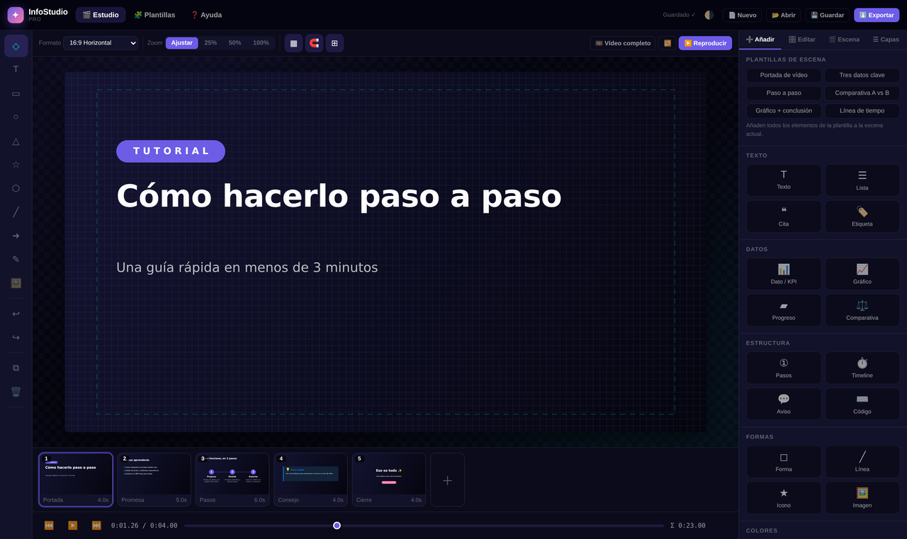
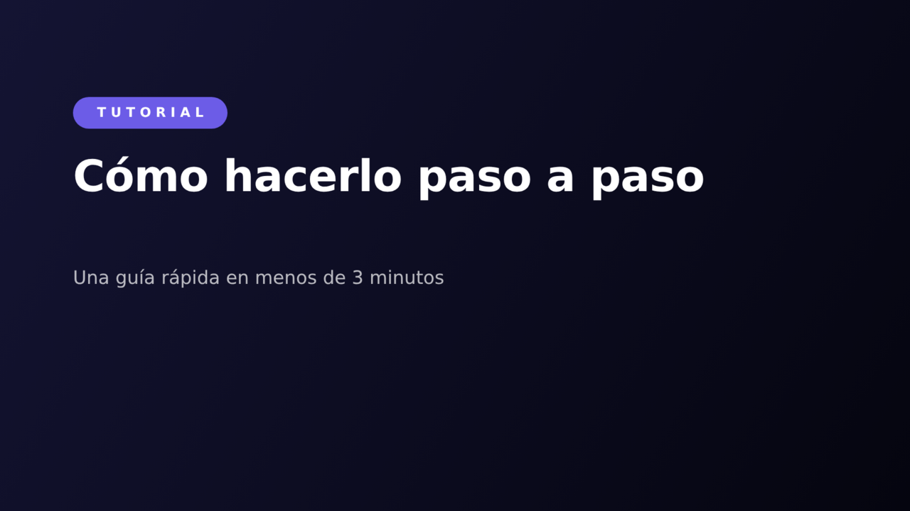
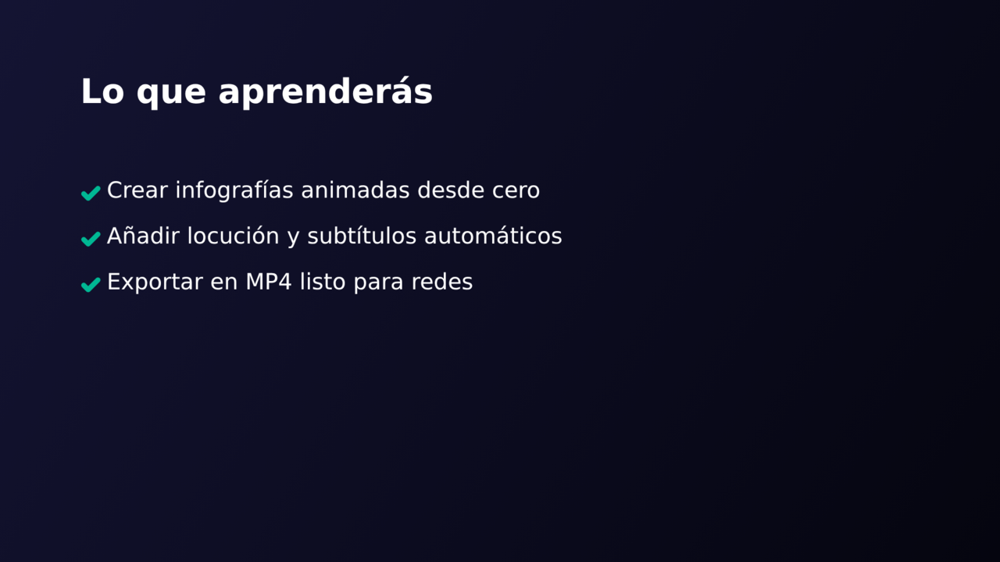
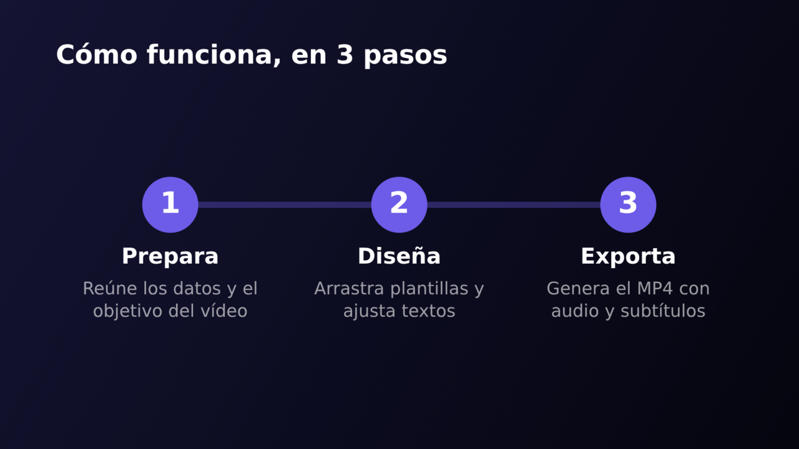
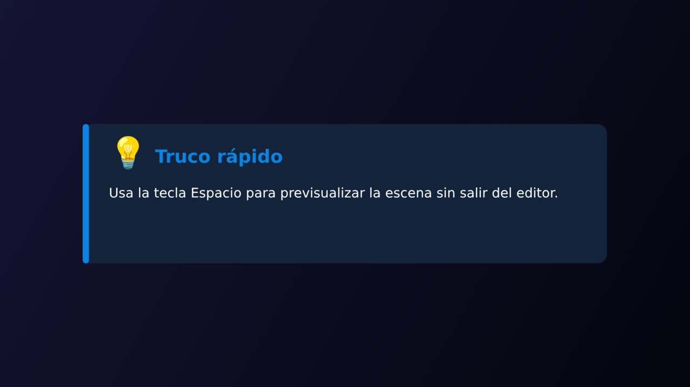
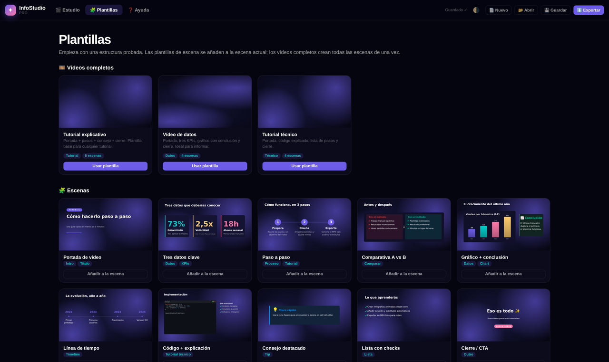

# InfoStudio Pro 🎬

**Estudio en el navegador para crear vídeo-infografías y tutoriales**: escenas animadas con gráficos, KPIs, pasos, comparativas y líneas de tiempo, más locución y subtítulos. Exporta a vídeo, PNG, SRT/VTT o HTML autónomo.

Sin servidores, sin cuentas, sin dependencias de terceros y funcionando **offline** (PWA).

[](LICENSE)
[](#arquitectura)
[](#producción)
[](#arquitectura)
[](#uso)

**[▶️ Demo en vivo](https://aurenox-global.github.io/studiovisualtest/)**



---

## ✨ Qué incluye

| Área | Capacidades |
|---|---|
| **Storyboard** | Escenas (planos) en tira tipo *film-strip* con miniaturas reales, duración, reordenar, duplicar y transiciones |
| **Lienzo** | 16:9 · 9:16 · 1:1 · 4:5 · 4:3, zoom, rejilla, imán *(snapping)* a bordes/centros y guías de área segura |
| **Infografías** | Título, lista, cita, etiqueta, KPI animado, 7 tipos de gráfico (barras, barras H, líneas, área, circular, anillo, radar), progreso, comparativa A/B, pasos, timeline, aviso, bloque de código con resaltado, formas, líneas/flechas, 42 iconos vectoriales e imágenes |
| **Animación** | 12 entradas + salidas por elemento con retardo, duración y 10 curvas de *easing*; gráficos y contadores se animan solos |
| **Edición** | Selección múltiple, mover/redimensionar/rotar (`Shift` para proporción y ángulos), marquesina, alinear, distribuir, capas con visibilidad/bloqueo y deshacer/rehacer ilimitado en sesión |
| **Locución** | Guion por escena, previsualización con la voz del sistema, estimación de duración y subtítulos `.srt`/`.vtt` automáticos |
| **Exportar** | 🎥 Vídeo WebM/MP4, 🖼️ PNG de escena, secuencia PNG en ZIP, miniatura 1280×720, 📝 subtítulos, guion `.md`, 🌐 HTML autónomo con reproductor y 💾 proyecto `.json` |
| **Plantillas** | 10 plantillas de escena + 3 vídeos completos (tutorial, datos, técnico) |
| **Producción** | PWA offline, tema claro/oscuro, accesible por teclado, sin CDN, autoguardado local e importar/exportar |

<details>
<summary><b>Ver galería de escenas generadas con las plantillas</b></summary>

| Portada | Lo que aprenderás |
|---|---|
|  |  |

| Paso a paso | Consejo |
|---|---|
|  |  |



</details>

---

## 🚀 Uso

**Local (recomendado):** cualquier servidor estático — los módulos y el *service worker* necesitan `http(s)://`.

```bash
git clone https://github.com/aurenox-global/studiovisualtest.git
cd studiovisualtest
python3 -m http.server 8080
# abre http://localhost:8080
```

**GitHub Pages:** sube el contenido de esta carpeta a la raíz del repositorio (`index.html` en la raíz) y activa *Pages → Deploy from branch → `main` / `root`*. El archivo `.nojekyll` ya está incluido.

**Docker / nginx:** cualquier `nginx:alpine` con esta carpeta como *root* sirve la aplicación.

---

## 🎞️ Flujo de trabajo

1. **Escenas** – crea planos en la tira inferior.
2. **Añadir** – inserta componentes desde el panel o usa una **plantilla**.
3. **Editar** – textos, colores, animación y alineación del elemento activo.
4. **Escena** – fondo animado, transición, duración y **locución**.
5. **Exportar** – pulsa ⬇️ y elige el formato.

### Atajos de teclado

`V` seleccionar · `X` texto · `R` rectángulo · `O` círculo · `G` triángulo · `S` estrella · `P` polígono · `L` línea · `A` flecha · `D` dibujo libre · `I` imagen · `Espacio` reproducir/pausar · `Ctrl+Z` / `Ctrl+Shift+Z` deshacer/rehacer · `Ctrl+D` duplicar · `Ctrl+A` seleccionar todo · `Supr` borrar · `Ctrl+S` guardar · `Ctrl`+rueda zoom · `←↑→↓` mover 1 px (`Shift` 10 px) · `Alt`+arrastrar duplicar · `PageUp`/`PageDown` cambiar de escena.

> **Nota sobre el autoajuste de texto:** los cuadros de texto **reducen su tipografía automáticamente** para que el texto siempre entre en su caja. El valor *Tamaño* del inspector es el tamaño máximo.

---

## 🎥 Calidad de exportación

- **Vídeo**: se graba en tiempo real con `MediaRecorder`, eligiendo el mejor códec disponible (`MP4/H.264` o `WebM/VP9`). Marca *Grabar micrófono* para narrar en directo: el audio se mezcla en el propio vídeo.
- **Máxima precisión (recomendado para publicación):** exporta *Secuencia PNG (ZIP)* y móntala con `ffmpeg`:

```bash
unzip mi_proyecto_frames.zip -d frames
ffmpeg -framerate 30 -i frames/frame_%05d.png \
       -c:v libx264 -pix_fmt yuv420p -crf 18 -movflags +faststart salida.mp4

# con locución:
ffmpeg -framerate 30 -i frames/frame_%05d.png -i narracion.wav \
       -c:v libx264 -crf 18 -c:a aac -shortest salida.mp4
```

- **Subtítulos**: genera el `.srt` a partir de la locución de cada escena e incrústalo con `-vf subtitles=salida.srt`.

---

## 🧱 Arquitectura

```
.
├── index.html                 # shell de la aplicación
├── manifest.webmanifest       # PWA
├── sw.js                      # service worker (offline, sin terceros)
├── assets/
│   ├── css/app.css            # design tokens + layout + componentes
│   ├── icons/                 # icono vectorial + PNG (PWA) + imagen social
│   └── js/
│       ├── util.js            # DOM, matemáticas, easing, color, UI chrome
│       ├── store.js           # modelo, selección, historial, persistencia
│       ├── library.js         # iconos, fondos animados, plantillas
│       ├── render.js          # renderer determinista (canvas) + animación
│       ├── editor.js          # interacción de lienzo, snapping, overlay
│       ├── ui.js              # paneles, inspector, escenas, transporte
│       ├── exporter.js        # vídeo, PNG/ZIP, subtítulos, HTML, TTS
│       └── app.js             # bootstrap, atajos, drag & drop, PWA
├── docs/screenshots/          # capturas usadas en este README
├── tests/smoke.py             # prueba de humo (Playwright, headless)
├── AUDIT.md                   # auditoría del proyecto original
└── LICENSE
```

**Principios**

- **Render determinista**: `render.frame(ctx, project, scene, t)` no depende del DOM ni del tiempo real → lo mismo se ve en el editor, en la miniatura y en la exportación (*frame-accurate*).
- **Estado único**: `IS.store` es la única fuente de verdad; la UI reacciona a eventos (`project`, `selection`, `scene`, `changed`). Historial por *snapshots* para un deshacer fiable.
- **Sin dependencias ni build step**: JS clásico con namespaces (`window.IS`), sin CDN, compatible con `file://` para desarrollo rápido.

---

## 🧪 Tests

```bash
pip install playwright && playwright install chromium
python3 tests/smoke.py
```

Arranca la app en Chromium headless, recorre edición, plantillas y exportación y verifica **0 errores de consola** en cada paso (incluye regresión del bug de geometría de las plantillas de vídeo).

---

## 🗺️ Roadmap

- Edición de texto *in situ* sobre el lienzo (hoy en el inspector).
- Curvas de animación por fotogramas clave (keyframes por propiedad).
- Subtítulos incrustados por reconocimiento de voz (Whisper vía WASM).
- Exportación directa a MP4 por WebCodecs (sin tiempo real).
- Música de fondo con *ducking* automático.
- i18n es/en (la estructura de preferencias ya está preparada).

---

## 🤝 Contribuir

Las contribuciones son bienvenidas: abre un *issue* o un *pull request*. Antes de enviar cambios, ejecuta `python3 tests/smoke.py` y mantén la app sin dependencias externas ni peticiones a terceros.

---

## 📄 Licencia

MIT — ver [`LICENSE`](LICENSE).

---

> Reescritura a nivel de producción del proyecto `studiovisualtest`
> (el antiguo “UX/UI Design Studio Pro”, una única página de ~120 KB). Consulta
> [`AUDIT.md`](AUDIT.md) para la auditoría del original y el detalle de todo lo que cambia.
